# Programos naudojimo instrukcija

Programos esmė — apdoroti ar generuoti studentų duomenis.

Programa turi 6 skirtingas eigas, matomas pradiniame programos meniu:

1. Studentų duomenų įvedimas iš duomenų failo

- Naudotojas gali pasirinkti aplanke "ivesties_failai" esančius tekstinius failus su studentų duomenimis (vardu, pavarde, pažymiais), apdoroti failą ir išvesti rezultatus (apie apdorojimą, išvedimą žr. žemiau).

2. Studentų ir jų pažymių įvedimas ranka

- Naudotojas gali pats ranka įvesti norimą skaičių studentų ir jų pažymius, duomenys apdorojami ir išvedamas rezultatas.

3. Studentų duomenų įvedimas ranka ir jų pažymių sugeneravimas

- Naudotojas gali ranka įvesti norimą skaičių studentų ir sugeneruoti jiems norimą skaičių pažymių, duomenys apdorojami ir išvedamas rezultatas.

4. Studentų ir jų pažymių sugeneravimas

- Naudotojo pageidavimu gali būti sugeneruojamas norimas skaičius studentų su norimu skaičiumi pažymių, duomenys apdorojami ir išvedamas rezultatas.

5. Studentų ir jų pažymių išvedimas į failą

- Naudotojo pageidavimu gali būti sugeneruojamas norimas skaičius studentų su norimu skaičiumi pažymių ir duomenys išvedami į failą.

6. Programos baigimas

Duomenų apdorojimas ir išvedimas:

- Įvedus ar sugeneravus studentų ir jų pažymių duomenis, naudotojas gali pasirinkti galutinio vertinimo skaičiavimo būdą (pagal vidurkį arba medianą), pasirinkti studentų surikiavimą išvestyje (pagal vardą, pavardę, galutinį balą (vidurkį/medianą) arba nerikiuoti) ir pasirinkti išvesties failo pavadinimą. Rezultatas (lentelės pavidalo) išvedamas folderyje isvesties_failai į tekstinį failą su naudotojo pageidautu pavadinimu.

# Diegimo instrukcija

...

# Programos leidimai

## v1.0 pradinė

### Skirtingi konteineriai

- Programos kodas pritaikytas trims skirtingiems duomenų konteineriams: std::vector, std::deque, std::list.

### Optimizavimas

- Pagerintas programos veikimas: pagerinta programos sparta ir atminties naudojimas.
- Programos versijų su skirtingais konteineriais trukmės testavimas aprašytas README.md faile.

## v0.4

### Failų generavimas

- Pridėtas visų studentų duomenų (įskaitant ir paskirus pažymius) failo generavimo funkcionalumas.

### Studentų išvesties skirstymas

- Studentų duomenys išvedami į du atskirus failus, atrenkant pagal studentų galutinį įvertinimą — vidurkį/medianą (< 5.0 vienur, >= 5.0 kitur).

### Programos trukmės matavimas

- Programoje pridėti nauji programos etapų trukmės matavimai (failų kūrimo ir apdorojimo).
- Programos trukmės testavimo skirtingais krūviais aprašas pridėtas į projekto README.md failą.

## v0.3

### Pakeitimai:

- Projektas suskaidytas į atskirus savo paskirties failus;
- Programoje pridėta daugiau išimčių valdymo;
- Programos funkcijos tapo labiau struktūruotos.

## v0.2

### Failų funkcionalumas

- Pridėta galimybė duomenis nuskaityti iš pasirinkto failo.
- Įtraukta galimybė išvestyje studentus surūšiuoti pagal pasirinktą parametrą: vardą, pavardę, galutinį pažymį (vidurkio ar medianos); didėjimo ar mažėjimo tvarka.
- Pridėta programos išvestis į failą.

## v0.1

### Meniu

Pridėtas programos meniu, siūlantis 4 skirtingas programos eigas:

- rankinis visų duomenų įvedimas;
- rankinis vardų įvedimas, pažymių sugeneravimas;
- visų duomenų sugeneravimas;
- programos baigimas.

## v.pradinė

Pradinės versijos programa, kuri:

- nuskaito studentų duomenis (vardą, pavardę, pažymius, egzaminų įvertinimą);
- apskaičiuoja galutinį balą (pagal vidurkį arba medianą);
- pateikia visus reikalingus duomenis lentelėje.

# Programos trukmės testavimai

Programos ir kai kurių jos etapų trukmė išmatuota trims programos versijoms, naudojančioms skirtingus duomenų konteinerius: std::vector, std::deque ir std::list. Testavimai atlikti kiekvienai versijai su 5 skirtingų dydžių failų apdorojimu (nuo 1 tūkst. iki 10 mln. įrašų), su 5 pakartojimais kiekvienu atveju.

Testavimo sistemos parametrai:

- CPU: AMD Ryzen 5 4600H 3GHz
- RAM: 16 GB
- SSD: Lexar SSD NM710 1TB

## 1. strategija

### 1. Programos versija su std::vector

##### 1 000 įrašų

##### 10 000 įrašų

##### 100 000 įrašų

##### 1 000 000 įrašų

##### 10 000 000 įrašų

### 2. Programos versija su std::deque

##### 1 000 įrašų:

##### 10 000 įrašų:

##### 100 000 įrašų:

##### 1 000 000 įrašų:

##### 10 000 000 įrašų:

### 3. Programos versija su std::list

##### 1 000 įrašų:

##### 10 000 įrašų:

##### 100 000 įrašų:

##### 1 000 000 įrašų:

##### 10 000 000 įrašų:

### Laikų vidurkiai

##### std::vector:

| Failo įrašų sk.   | 1 tūkst.   | 10 tūkst.  | 100 tūkst. | 1 mln.    | 10 mln.  |
| ----------------- | ---------- | ---------- | ---------- | --------- | -------- |
| Nuskaitymas (s)   | 0,0034203  | 0,0309502  | 0,3051384  | 3,036604  | 30,2957  |
| Surikiavimas (s)  | 0,00013062 | 0,00148628 | 0,01846376 | 0,2391284 | 2,929308 |
| Išskirstymas (s)  | 0,00009908 | 0,00081048 | 0,00806456 | 0,0992962 | 2,559528 |
| Visa programa (s) | 0,00648488 | 0,0460721  | 0,4485966  | 4,58635   | 48,77302 |

##### std::deque:

| Failo įrašų sk.   | 1 tūkst.   | 10 tūkst.  | 100 tūkst. | 1 mln.    | 10 mln.  |
| ----------------- | ---------- | ---------- | ---------- | --------- | -------- |
| Nuskaitymas (s)   | 0,0095191  | 0,032712   | 0,3172748  | 3,129548  | 31,40262 |
| Surikiavimas (s)  | 0,00049726 | 0,00698256 | 0,09231658 | 1,281324  | 15,66556 |
| Išskirstymas (s)  | 0,00014776 | 0,0015741  | 0,01706468 | 0,1747522 | 1,78443  |
| Visa programa (s) | 0,0070822  | 0,05854308 | 0,5698436  | 6,184886  | 74,05166 |

##### std::list:

| Failo įrašų sk.   | 1 tūkst.   | 10 tūkst.  | 100 tūkst. | 1 mln.    | 10 mln.  |
| ----------------- | ---------- | ---------- | ---------- | --------- | -------- |
| Nuskaitymas (s)   | 0,00717774 | 0,04976302 | 0,44904    | 4,491188  | 45,95596 |
| Surikiavimas (s)  | 0,00007962 | 0,0012681  | 0,02743122 | 0,5778892 | 10,14206 |
| Išskirstymas (s)  | 0,0000953  | 0,00165964 | 0,01984636 | 0,2471198 | 3,514694 |
| Visa programa (s) | 0,01023278 | 0,0727979  | 0,712057   | 8,099776  | 138,1736 |

Išvada: programos versija su std::vector veikia greičiausiai, su std::deque — apie 1,5 k. lėčiau, o su std::list lėčiausiai — kone 3 k. lėčiau nei su std::vector ir kone 2 k. lėčiau nei su std::deque.

## 2. strategija

### std::vector

##### 1 000 įrašų:

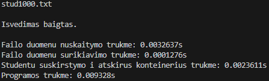
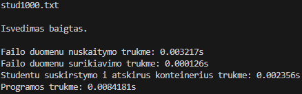
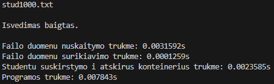

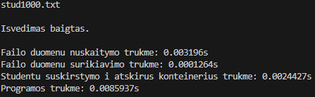

##### 10 000 įrašų:

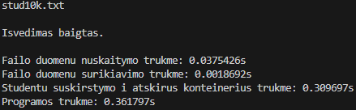
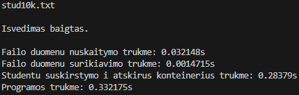
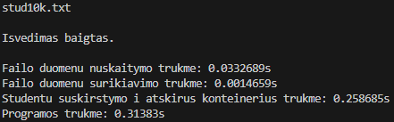
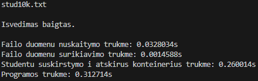
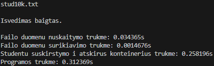

##### 100 000 įrašų:

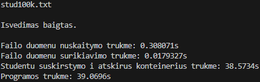
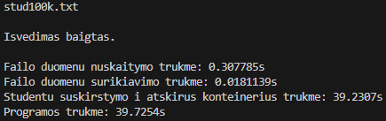
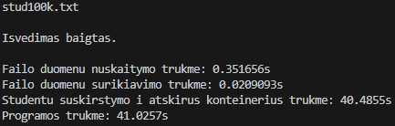
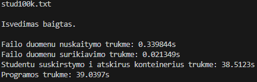
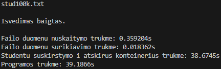

##### 1 000 000 / 10 000 000 įrašų:

Išmatuoti programos trukmės su 1 mln. ir 10 mln. įrašų kiekiais nepavyko: programa nesibaigė netgi palaukus pusvalandį. Atsižvelgiant į studentų skirstymo algoritmo kvadratinį sudėtingumą (ištrinant elementą, turi būti perstumdyti likę elementai), duomenų kiekiui padidėjus 10 kartų, laikas teoriškai turėtų pailgėti apie 100 k., taigi, lyginant su 100 tūkst. įrašų konteinerio testavimu, kuris truko apie 40 s, 1 mln. įrašų konteinerio testavimas galėtų trukti bent 40x100 = 4000 s (virš valandos), o 10 mln. — 4000x100 = 400 000 s (virš 4.5 paros). Tačiau, atsižvelgiant į didesnį nei 100 k. skirtumą tarp 100 tūkst. ir 10 tūkst. įrašų konteinerių testavimų (39,6094 / 0,326577 ≈ 121 k.), reali 1 mln. ir 10 mln. įrašų konteinerių testavimų trukmė galėtų būti dar didesnė.

### std::deque

##### 1 000 įrašų:

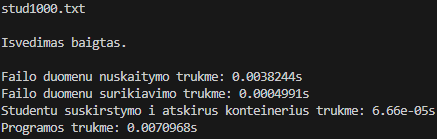
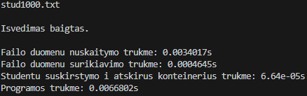
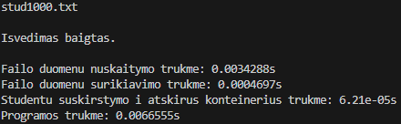
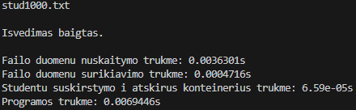
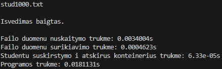

##### 10 000 įrašų:

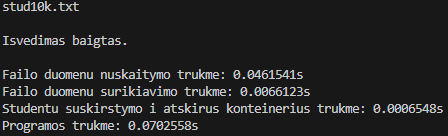
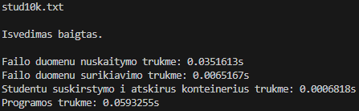
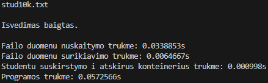
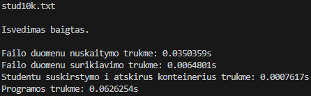
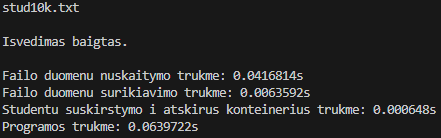

##### 100 000 įrašų:

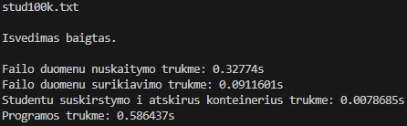
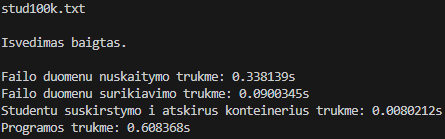
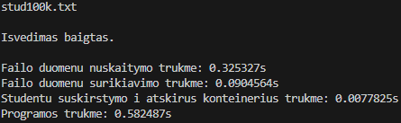
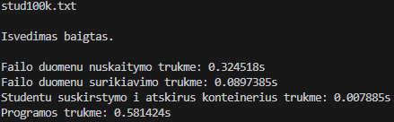
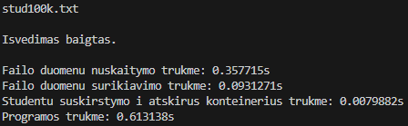

##### 1 000 000 įrašų:

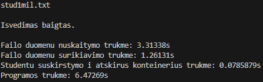
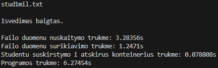
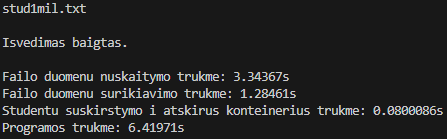
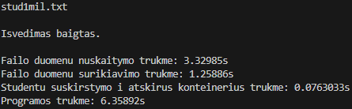
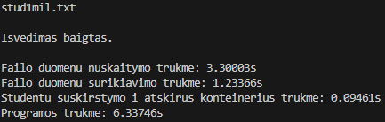

##### 10 000 000 įrašų:

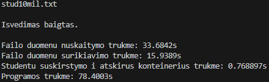
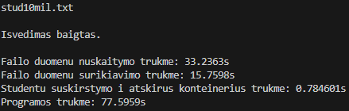
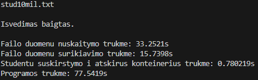
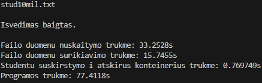
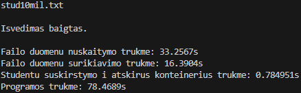

### std::list:

##### 1 000 įrašų:

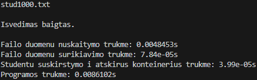
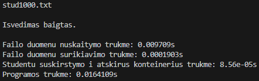
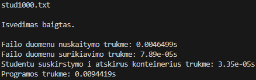
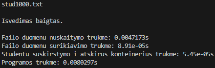
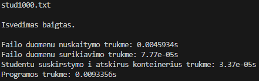

##### 10 000 įrašų:

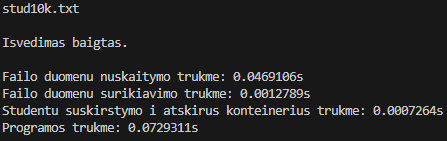
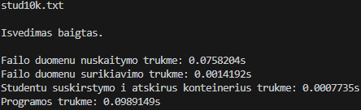
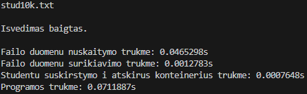
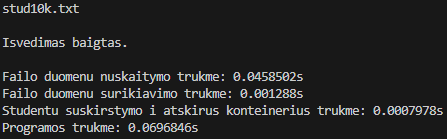
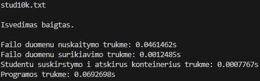

##### 100 000 įrašų:

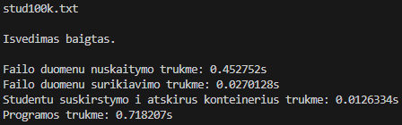

##### 1 000 000 įrašų:

##### 10 000 000 įrašų:

### Laikų vidurkiai

##### std::vector:

| Failo įrašų sk.   | 1 tūkst.   | 10 tūkst.  | 100 tūkst. | 1 mln. | 10 mln. |
| ----------------- | ---------- | ---------- | ---------- | ------ | ------- |
| Nuskaitymas (s)   | 0,00320758 | 0,03402558 | 0,333312   | -      | -       |
| Surikiavimas (s)  | 0,00012632 | 0,0015466  | 0,01933338 | -      | -       |
| Išskirstymas (s)  | 0,00243372 | 0,2740764  | 39,09528   | -      | -       |
| Visa programa (s) | 0,00854098 | 0,326577   | 39,6094    | -\*    | -\*     |

\*Remiantis algoritmo pobūdžiu ir esamais matavimo duomenimis, teorinė 1 mln. testavimo trukmė: virš 1 val., 10 mln. — virš 4,5 paros.

##### std::deque:

| Failo įrašų sk.   | 1 tūkst.   | 10 tūkst.  | 100 tūkst. | 1 mln.     | 10 mln.   |
| ----------------- | ---------- | ---------- | ---------- | ---------- | --------- |
| Nuskaitymas (s)   | 0,00353708 | 0,0383836  | 0,3346878  | 3,314098   | 33,33642  |
| Surikiavimas (s)  | 0,00047344 | 0,006487   | 0,09090332 | 1,257108   | 15,91488  |
| Išskirstymas (s)  | 0,00006486 | 0,00074886 | 0,00790908 | 0,08166356 | 0,7776834 |
| Visa programa (s) | 0,00909804 | 0,0626871  | 0,5943708  | 6,372664   | 77,88376  |

##### std::list:

| Failo įrašų sk.   | 1 tūkst.   | 10 tūkst.  | 100 tūkst. | 1 mln.    | 10 mln.  |
| ----------------- | ---------- | ---------- | ---------- | --------- | -------- |
| Nuskaitymas (s)   | 0,00570298 | 0,05225144 | 0,4573822  | 4,584298  | 45,38584 |
| Surikiavimas (s)  | 0,00010288 | 0,00130258 | 0,0304274  | 0,588567  | 10,31716 |
| Išskirstymas (s)  | 0,00004944 | 0,00076784 | 0,01517834 | 0,1673388 | 2,165952 |
| Visa programa (s) | 0,01036566 | 0,07639782 | 0,7316634  | 8,249734  | 136,6016 |

##### Išvados:

Išvados: lyginant su 1-osios strategijos programos versija, std::deque ir std::list visos programos trukmė išliko panaši, nors studentų išskirstymo trukmė gana ryškiai sumažėjo. Tuo tarpu std::vector programa itin ženkliai sulėtėjo. Matyti, jog std::vector programos trukmė auga eksponentiškai, priklausomai nuo duomenų (įrašų) kiekio. Dėl to nepavyko nustatyti tikslios std::vector programos trukmės apdorojant 1 mln. ir 10 mln. įrašų. Atsižvelgiant į mažesnio studentų sk. išskirstymo laikus ir į išskirstymo algoritmo teorinį sudėtingumą, tikėtina, jog std::vector programoje 1 mln. studentų išskirstymas matuotinas valandomis, o 10 mln. — paromis.

## 3. strategija

3-oji studentų skirstymo strategija paremta 2-osios principu, tačiau pritaikyti algoritmai std::stable_partition, std::move, kuo mėginta pagreitinti studentų skirstymą.

### std::vector:

##### 1 000 įrašų:

##### 10 000 įrašų:

##### 100 000 įrašų:

##### 1 000 000 įrašų:

##### 10 000 000 įrašų:

### std::deque:

##### 1 000 įrašų:

##### 10 000 įrašų:

##### 100 000 įrašų:

##### 1 000 000 įrašų:

##### 10 000 000 įrašų:

...

### std::list:

##### 1 000 įrašų:

##### 10 000 įrašų:

##### 100 000 įrašų:

##### 1 000 000 įrašų:

##### 10 000 000 įrašų:

### Laikų vidurkiai:

##### std::vector:

| Failo įrašų sk.   | 1 tūkst.   | 10 tūkst.  | 100 tūkst. | 1 mln.     | 10 mln.   |
| ----------------- | ---------- | ---------- | ---------- | ---------- | --------- |
| Nuskaitymas (s)   | 0,00326928 | 0,03362434 | 0,3147096  | 3,132346   | 31,53802  |
| Surikiavimas (s)  | 0,00012584 | 0,00147244 | 0,0186556  | 0,2408318  | 2,89344   |
| Išskirstymas (s)  | 0,00006314 | 0,00056424 | 0,00716718 | 0,06777242 | 0,7116158 |
| Visa programa (s) | 0,0061401  | 0,0492335  | 0,4677638  | 4,7398     | 49,27956  |

##### std::deque:

| Failo įrašų sk.   | 1 tūkst.   | 10 tūkst.  | 100 tūkst. | 1 mln.    | 10 mln.  |
| ----------------- | ---------- | ---------- | ---------- | --------- | -------- |
| Nuskaitymas (s)   | 0,035729   | 0,03580368 | 0,3115498  | 3,105098  | 31,0364  |
| Surikiavimas (s)  | 0,00047946 | 0,0067865  | 0,09429506 | 1,232112  | 16,04648 |
| Išskirstymas (s)  | 0,00038184 | 0,00622372 | 0,07016274 | 0,7563142 | 23,24168 |
| Visa programa (s) | 0,00738288 | 0,06543044 | 0,6277952  | 6,893812  | 111,1286 |

##### std::list:

| Failo įrašų sk.   | 1 tūkst.   | 10 tūkst.  | 100 tūkst. | 1 mln.    | 10 mln.  |
| ----------------- | ---------- | ---------- | ---------- | --------- | -------- |
| Nuskaitymas (s)   | 0,00470258 | 0,04648364 | 0,445728   | 4,457746  | 44,67682 |
| Surikiavimas (s)  | 0,00008142 | 0,0012533  | 0,02947732 | 0,5856046 | 10,2377  |
| Išskirstymas (s)  | 0,0000871  | 0,00171152 | 0,0433709  | 0,5284458 | 6,609782 |
| Visa programa (s) | 0,00748806 | 0,07079574 | 0,7310016  | 8,264144  | 139,3666 |

### Išvados:

Lyginant su 2-ąja strategija:

- std::vector studentų skirstymas veikia kone nepalyginamai greičiau:
  - skirtumas su 1 tūkst. įrašų: 38,5 k.
  - skirtumas su 10 tūkst. įrašų: 44 k.
  - skirtumas su 100 tūkst. įrašų: 557 k.
  - skirtumas su 1 mln. ir 10 mln. — tiksliai nenustatytas, tačiau, tikėtina, siekiantis tūkstančius ar milijonus kartų
- std::deque studentų skirstymas veikia žymiai lėčiau:
  - skirtumas su 1 tūkst. įrašų: 6 k.
  - skirtumas su 10 tūkst. įrašų: 8 k.
  - skirtumas su 100 tūkst. įrašų: 9 k.
  - skirtumas su 1 mln. įrašų: 9 k.
  - skirtumas su 10 mln. įrašų: 30 k.
- std::list studentų skirstymas veikia lėčiau:
  - skirtumas su 1 tūkst. įrašų: 1,8 k.
  - skirtumas su 10 tūkst. įrašų: 2,2 k.
  - skirtumas su 100 tūkst. įrašų: 2,9 k.
  - skirtumas su 1 mln. įrašų: 3,2 k.
  - skirtumas su 10 mln. įrašų: 3,1 k.

Lyginant su 1-ąja strategija:

- std::vector studentų skirstymas veikia greičiau:
  - skirtumas su 1 tūkst. įrašų: 1,6 k.
  - skirtumas su 10 tūkst. įrašų: 1,4 k.
  - skirtumas su 100 tūkst. įrašų: 1,1 k.
  - skirtumas su 1 mln. įrašų: 1,5 k.
  - skirtumas su 10 mln. įrašų: 3,6 k.
- std::deque studentų skirstymas veikia lėčiau:
  - skirtumas su 1 tūkst. įrašų: 2,6 k.
  - skirtumas su 10 tūkst. įrašų: 4 k.
  - skirtumas su 100 tūkst. įrašų: 4,1 k.
  - skirtumas su 1 mln. įrašų: 4,3 k.
  - skirtumas su 10 mln. įrašų: 13 k.
- std::list studentų skirstymas veikia šiek tiek lėčiau arba panašiu greičiu:
  - skirtumas su 1 tūkst. įrašų: 0,91 k.
  - skirtumas su 10 tūkst. įrašų: 1,03 k.
  - skirtumas su 100 tūkst. įrašų: 2,2 k.
  - skirtumas su 1 mln. įrašų: 2,1 k.
  - skirtumas su 10 mln. įrašų: 1,9 k.

Taigi, 3-ąja strategija pavyko optimizuoti std::vector programos versijos studentų skirstymą (ypač lyginant su 2-ąja strategija). Tačiau 3-oji strategija šiek tiek sulėtino std::list programos versijos studentų skirstymą, o std::deque versijos studentų skirstymas sulėtėjo itin žymiai.
