# Programa

## Funkcionalumas

### Programa:

- nuskaito arba sugeneruoja studentų duomenis (vardą, pavardę, pažymius, egzamino įvertinimą);
- apskaičiuoja galutinį balą (pagal vidurkį arba medianą);
- pateikia visus reikalingus duomenis lentelėje.

## Programos trukmės testavimai

Programos ir kai kurių jos etapų trukmė išmatuota trims programos versijoms, naudojančioms skirtingus duomenų konteinerius: std::vector, std::deque ir std::list. Testavimai atlikti kiekvienai versijai su 5 skirtingų dydžių failų apdorojimu (nuo 1 tūkst. iki 10 mln. įrašų), su 5 pakartojimais kiekvienu atveju.

Testavimo sistemos parametrai:

- CPU: AMD Ryzen 5 4600H 3GHz
- RAM: 16 GB
- SSD: Lexar SSD NM710 1TB

### 1. Programos versija su std::vector

##### 1 000 įrašų

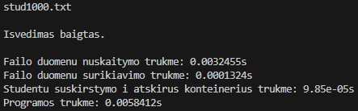

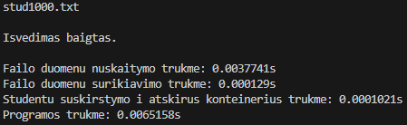

##### 10 000 įrašų

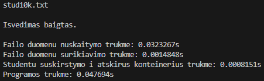

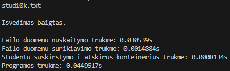

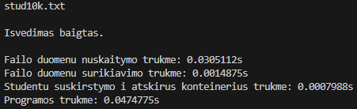

##### 100 000 įrašų

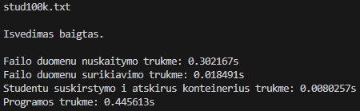

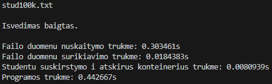

##### 1 000 000 įrašų

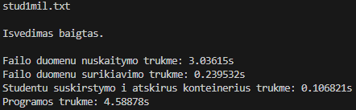
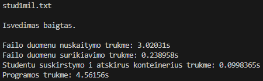

##### 10 000 000 įrašų

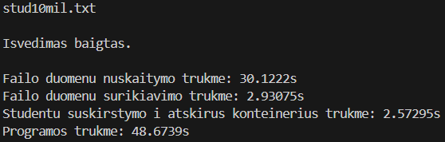
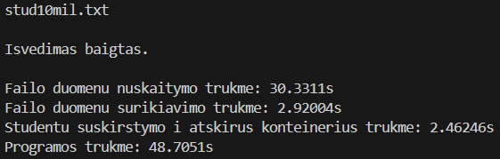

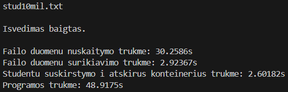
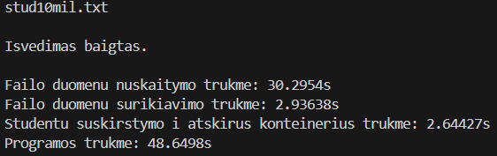

### 2. Programos versija su std::deque

##### 1 000 įrašų:

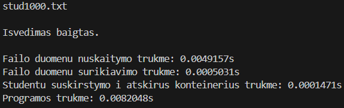
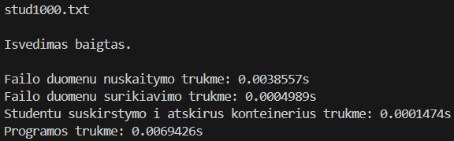

##### 10 000 įrašų:

##### 100 000 įrašų:

##### 1 000 000 įrašų:

##### 10 000 000 įrašų:

### 3. Programos versija su std::list

##### 1 000 įrašų:

##### 10 000 įrašų:

##### 100 000 įrašų:

##### 1 000 000 įrašų:

##### 10 000 000 įrašų:

### Laikų vidurkiai

##### std::vector:

| Failo įrašų sk.   | 1 tūkst.   | 10 tūkst.  | 100 tūkst. | 1 mln.    | 10 mln.  |
| ----------------- | ---------- | ---------- | ---------- | --------- | -------- |
| Nuskaitymas (s)   | 0,0034203  | 0,0309502  | 0,3051384  | 3,036604  | 30,2957  |
| Surikiavimas (s)  | 0,00013062 | 0,00148628 | 0,01846376 | 0,2391284 | 2,929308 |
| Išskirstymas (s)  | 0,00009908 | 0,00081048 | 0,00806456 | 0,0992962 | 2,559528 |
| Visa programa (s) | 0,00648488 | 0,0460721  | 0,4485966  | 4,58635   | 48,77302 |

##### std::deque:

| Failo įrašų sk.   | 1 tūkst.   | 10 tūkst.  | 100 tūkst. | 1 mln.    | 10 mln.  |
| ----------------- | ---------- | ---------- | ---------- | --------- | -------- |
| Nuskaitymas (s)   | 0,0095191  | 0,032712   | 0,3172748  | 3,129548  | 31,40262 |
| Surikiavimas (s)  | 0,00049726 | 0,00698256 | 0,09231658 | 1,281324  | 15,66556 |
| Išskirstymas (s)  | 0,00014776 | 0,0015741  | 0,01706468 | 0,1747522 | 1,78443  |
| Visa programa (s) | 0,0070822  | 0,05854308 | 0,5698436  | 6,184886  | 74,05166 |

##### std::list:

| Failo įrašų sk.   | 1 tūkst.   | 10 tūkst.  | 100 tūkst. | 1 mln.    | 10 mln.  |
| ----------------- | ---------- | ---------- | ---------- | --------- | -------- |
| Nuskaitymas (s)   | 0,00717774 | 0,04976302 | 0,44904    | 4,491188  | 45,95596 |
| Surikiavimas (s)  | 0,00007962 | 0,0012681  | 0,02743122 | 0,5778892 | 10,14206 |
| Išskirstymas (s)  | 0,0000953  | 0,00165964 | 0,01984636 | 0,2471198 | 3,514694 |
| Visa programa (s) | 0,01023278 | 0,0727979  | 0,712057   | 8,099776  | 138,1736 |

Išvada: programos versija su std::vector veikia greičiausiai, su std::deque — apie 1,5 k. lėčiau, o su std::list lėčiausiai — kone 3 k. lėčiau nei su std::vector ir kone 2 k. lėčiau nei su std::deque.
