# Programa

## Funkcionalumas

### Programa:

- nuskaito arba sugeneruoja studentų duomenis (vardą, pavardę, pažymius, egzamino įvertinimą);
- apskaičiuoja galutinį balą (pagal vidurkį arba medianą);
- pateikia visus reikalingus duomenis lentelėje.

## Programos trukmės testavimai

### 1. Programos versija su std::vector

##### 1 000 įrašų

##### 10 000 įrašų

##### 100 000 įrašų

##### 1 000 000 įrašų

##### 10 000 000 įrašų

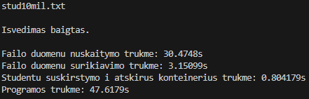

### 2. Programos versija su std::deque

##### 10 000 000 įrašų:

### 3. Programos versija su std::list

##### 1 000 įrašų:

##### 10 000 įrašų:

##### 100 000 įrašų:

##### 1 000 000 įrašų:

##### 10 000 000 įrašų:

### 1. Failo sukūrimas

Kuriant studentų duomenų failus, kiekvienam studentui parinkta sugeneruoti 15 pažymių. Testavimas vykdytas 5 skirtingais generuosimų studentų (įrašų) skaičiais. Matuotas failo kūrimo ir jo uždarymo laikas. Testavimas atliktas po 5 kartus kiekvienam skirtingam failo dydžiui (nuo 1 tūkst. iki 10 mln. įrašų).

##### 1 000 įrašų:

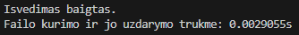
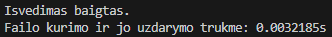
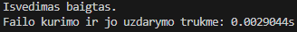
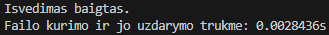
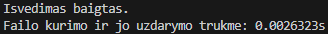

##### 10 000 įrašų:

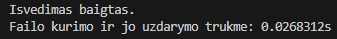
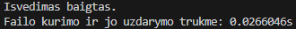
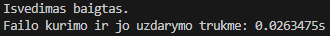
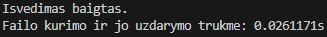
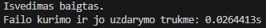

##### 100 000 įrašų:

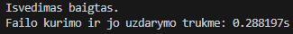
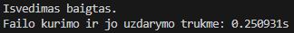
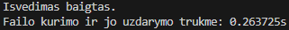
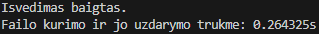
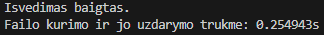

##### 1 000 000 įrašų:

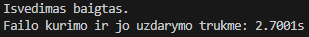
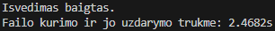
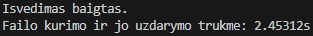
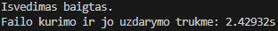
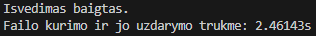

##### 10 000 000 įrašų:

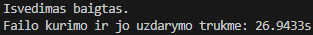
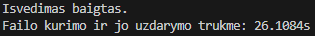
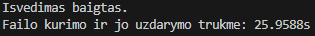
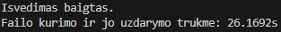
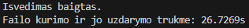

##### Vidurkiai

| Failo įrašų sk.    | 1 tūkst.   | 10 tūkst.  | 100 tūkst. | 1 mln.   | 10 mln. |
| ------------------ | ---------- | ---------- | ---------- | -------- | ------- |
| Laikų vidurkis (s) | 0,00290086 | 0,02646834 | 0,2644242  | 2,502434 | 26,7269 |

### 2. Duomenų apdorojimas

Kiekvienam testavimo kartojimui buvo parenkamas atitinkamo įrašų skaičiaus įvesties failas ir buvo parenkami tie patys studentų rikiavimo parametrai (pagal vidurkį didėjimo tvarka). Testavimas atliktas po 5 kartus kiekvienam skirtingam failo dydžiui (nuo 1 tūkst. iki 10 mln. įrašų).

##### 1 000 įrašų:

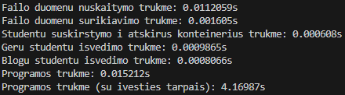
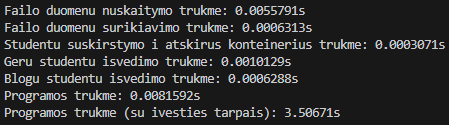
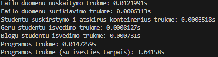
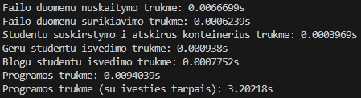
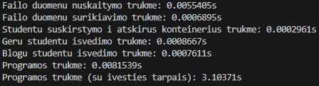

##### 10 000 įrašų:

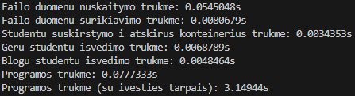
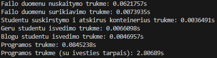
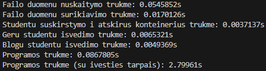

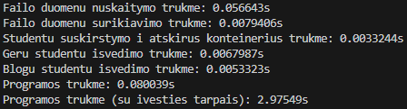

##### 100 000 įrašų:

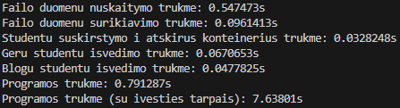
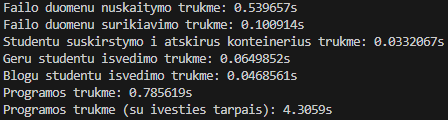
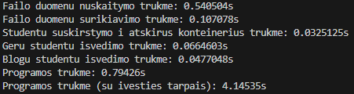
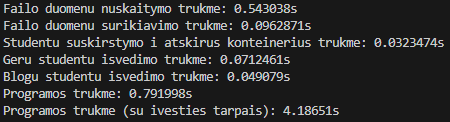
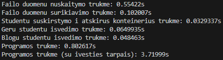

##### 1 000 000 įrašų:

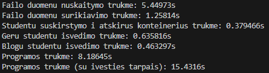
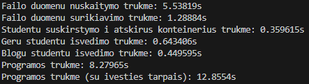
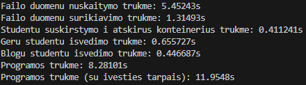
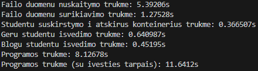
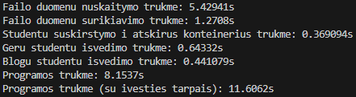

##### 10 000 000 įrašų:

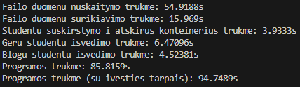
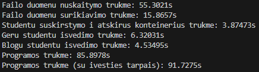
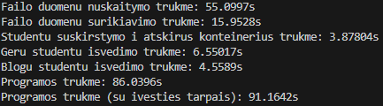
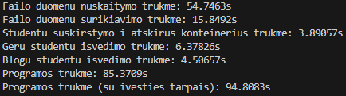
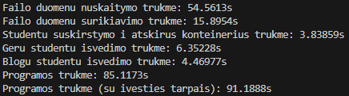

##### Vidurkiai

| Failo įrašų sk.              | 1 tūkst.   | 10 tūkst.  | 100 tūkst. | 1 mln.    | 10 mln.  |
| ---------------------------- | ---------- | ---------- | ---------- | --------- | -------- |
| Nuskaitymas (s)              | 0,0082389  | 0,05655488 | 0,5449784  | 5,452364  | 54,92564 |
| Surikiavimas (s)             | 0,0008362  | 0,00967478 | 0,10048548 | 1,281598  | 15,90642 |
| Išskirstymas (s)             | 0,00039198 | 0,00354602 | 0,03276502 | 0,3771846 | 3,883046 |
| Gerų studentų išvedimas (s)  | 0,00092336 | 0,00672996 | 0,06695008 | 0,6438512 | 6,414396 |
| Blogų studentų išvedimas (s) | 0,00074054 | 0,00489324 | 0,04797708 | 0,4505216 | 4,5188   |
| Visa programa\* (s)          | 0,01113098 | 0,08139888 | 0,7931562  | 8,205518  | 85,6483  |

\*Visa programa — visos programos trukmė (neįskaitant vartotojo įvesties intarpų).
